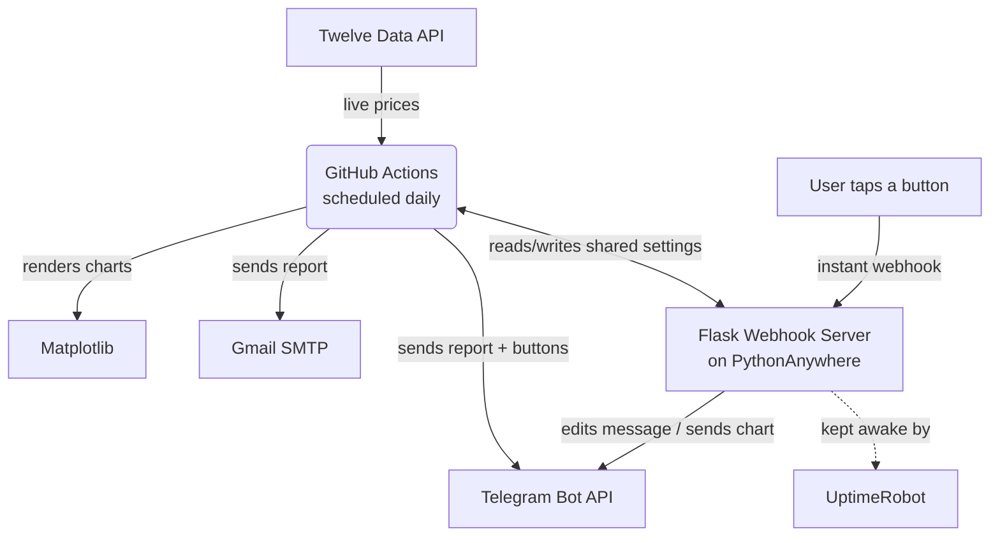

# 📊 Forex Bot — Automated Multi-Channel Market Analysis & Notification System

A fully autonomous, multi-service forex/gold price monitoring bot that fetches live market data, analyzes trends, generates charts, and delivers daily/weekly reports through **email** and an **interactive Telegram bot** — in **six languages** — with zero dependency on any personal device.

> Built as a hands-on learning project to move from "writing scripts" to shipping a real, production-style automation system: cloud scheduling, an always-on webhook server, secure secrets management, and a multi-user, multi-language interface.

---

## ✨ Key Features

- **📈 Live market data** — fetches real-time prices for user-selected forex pairs and metals via a public API
- **🔔 Smart alerts** — flags significant day-over-day price movements above a configurable threshold
- **🖼️ Auto-generated charts** — renders price-trend charts (Matplotlib) for every tracked symbol, delivered on demand via inline Telegram buttons
- **📅 Daily & weekly reports** — daily summary plus a configurable weekly recap (min/max/average/% change)
- **📬 Dual delivery channels** — email (text + charts) and Telegram (interactive, real-time)
- **🤖 Interactive Telegram bot**
  - Inline keyboards (no clutter — old messages are auto-deleted when a new report arrives)
  - Slash commands always available via the bot's `/` menu: `/symbols`, `/weekday`, `/language`
  - Per-symbol chart buttons — chart images are sent instantly from a cached `file_id`, no re-upload needed
  - **Multi-user support** — anyone who starts the bot is automatically subscribed to daily/weekly reports
- **🌍 Full localization (i18n)** — Persian, English, Turkish, Spanish, Arabic, and French, including correct right-to-left shaping/BiDi for chart titles in Persian and Arabic
- **☁️ 100% cloud-hosted** — no personal computer needs to be on; runs entirely on free-tier cloud infrastructure
- **🔐 Security-conscious** — no credentials ever committed to source code; all secrets live in GitHub Secrets / environment variables

---

## 🏗️ Architecture

The system is intentionally split across two complementary services to work around the limitations of free-tier hosting:



| Component | Responsibility |
|---|---|
| **GitHub Actions** | Scheduled daily/weekly job: fetches prices, builds charts, sends the report via email + Telegram, commits updated history back to the repo |
| **PythonAnywhere (Flask + Webhook)** | Always-on server that instantly handles Telegram button presses and slash commands (symbol selection, weekly-report day, language) — independent of GitHub Actions' schedule |
| **UptimeRobot** | Free external monitor that pings the webhook server every few minutes to prevent cold-start delays |
| **GitHub Secrets** | Stores every credential (API keys, email password, bot token, webhook secret) — never stored in code |

This split matters because GitHub Actions only runs *on a schedule* (not instantly reactive), while the webhook server needs to be *always on*. Splitting responsibilities this way keeps both sides on free hosting tiers.

---

## 🛠️ Tech Stack

- **Language:** Python 3.12
- **Web framework:** Flask
- **Data & charts:** `requests`, `matplotlib`
- **Internationalization:** `arabic-reshaper`, `python-bidi`
- **Messaging:** Telegram Bot API (webhooks, inline keyboards)
- **Email:** `smtplib` (SMTP over SSL/TLS)
- **CI/CD & scheduling:** GitHub Actions (`cron`)
- **Hosting:** PythonAnywhere (free tier)
- **Uptime monitoring:** UptimeRobot

---

## 📂 Project Structure

```
forex_bot/
├── .github/workflows/
│   └── daily.yml            # Scheduled job: fetch → analyze → chart → notify
├── main.py                  # Core bot logic (runs on GitHub Actions)
├── telegram_server.py       # Always-on Flask webhook server (runs on PythonAnywhere)
├── translations.py          # Shared i18n strings for all 6 supported languages
├── requirements.txt         # Dependencies for the GitHub Actions job
├── requirements_server.txt  # Dependencies for the PythonAnywhere web server
├── config.json              # Non-secret settings (backup copy; live copy lives on the server)
├── price_history.json       # Last known price per symbol (for day-over-day comparison)
├── price_series.json        # Rolling price history per symbol (for chart rendering)
└── pa_secrets.py            # ⚠️ Created only on PythonAnywhere — never committed to Git
```

---

## ⚙️ Configuration

All sensitive values are injected as environment variables / GitHub Secrets — never hardcoded.

| Secret | Purpose |
|---|---|
| `TWELVE_DATA_API_KEY` | Market data provider API key |
| `GMAIL_SENDER_EMAIL` / `GMAIL_APP_PASSWORD` / `GMAIL_RECEIVER_EMAIL` | Email delivery |
| `TELEGRAM_BOT_TOKEN` / `TELEGRAM_CHAT_ID` | Telegram bot & primary admin chat |
| `PA_CONFIG_URL` / `PA_API_SECRET` | Shared, token-protected settings endpoint on the webhook server |

---

## 💬 Telegram Commands

| Command | Description |
|---|---|
| `/start` | Registers the user to receive daily/weekly reports |
| `/symbols` | Opens an inline menu to select tracked symbols |
| `/weekday` | Sets which day of the week the weekly summary is sent |
| `/language` | Switches the bot's language (🇮🇷 🇬🇧 🇹🇷 🇪🇸 🇸🇦 🇫🇷) |

---

## 🌍 Supported Languages

🇮🇷 Persian &nbsp;•&nbsp; 🇬🇧 English &nbsp;•&nbsp; 🇹🇷 Turkish &nbsp;•&nbsp; 🇪🇸 Spanish &nbsp;•&nbsp; 🇸🇦 Arabic &nbsp;•&nbsp; 🇫🇷 French

Every report, menu, and chart title is fully translated — including correct right-to-left text shaping for Persian and Arabic chart titles.

---

## 🔐 Security Notes

- No API keys, tokens, or passwords are ever committed to this repository
- Gmail delivery uses an **App Password** (not the main account password), requiring 2-Step Verification
- The settings API (`/config`) on the webhook server is protected by a shared secret token
- Repository visibility and token scopes are kept as restrictive as practically possible

---

## 🚀 Possible Next Steps

- [ ] Per-user (not just global) symbol/language preferences for multi-user mode
- [ ] Historical performance dashboard
- [ ] Additional asset classes (crypto, stocks)

---

## 👤 Author

**Saman Uzi**
12th-grade Networking & Software student, learning to build AI-powered automation for freelance work.

- GitHub: [@Samkuzi](https://github.com/Samkuzi)
- Email: samanuudd@gmail.com

---

## 📄 License

This project is shared for portfolio and educational purposes.
